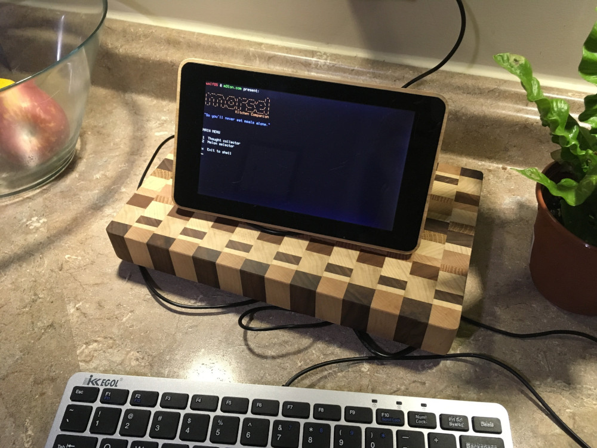

# Morsel: Kitchen Command Line

Access your [m3lon](https://www.m3lon.com) pantry from the [wolfOS](https://github.com/mirthturtle/wolfOS-legacy) terminal on your kitchen counter.

Features:
- Quickly record your thoughts and writings while you're in the kitchen
- Access the m3lon.com Melon Selector

## Installation

- Clone the repo into your home directory: `git clone https://github.com/mirthturtle/morsel-client.git`
- Install dependencies: `gem install colorize httparty`
- Add shortcut to ~/.bashrc: `alias morsel='cd /home/pi/morsel-client && ruby -Ilib bin/morsel'`

## Configuration
To connect Morsel to your m3lon pantry: 
- Find your Morsel Code on your pantry's Settings page
- Make it an environment variable by adding to ~/.bashrc: `export MORSEL_CODE=your-unique-code`
- Reload bashrc: `. ~/.bashrc`

## Running
- run the program with `morsel`
